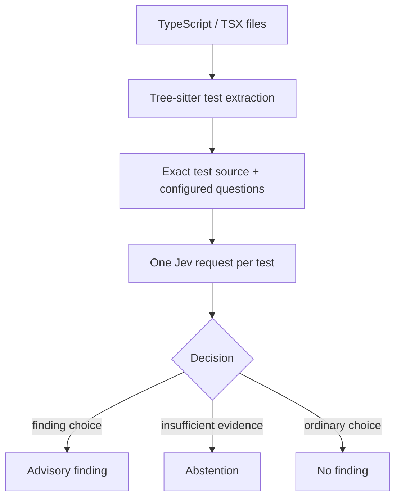

# Jev Code Review

Jev Code Review is a small, inspectable experiment in semantic review. It asks
whether a TypeScript test exercises product behavior and whether its assertions
protect the contract callers depend on. A companion research suite applies Jev
to 29 recurring review risks using synthetic PR excerpts.

Try the live playground: <https://jev-review-lab.luis-marchesi.chatgpt.site/>

> **Privacy:** source submitted to the CLI or playground is sent to the
> TypeSafe API. Do not submit secrets or code that is not approved for external
> processing.

## Quick start

Python 3.11+ and a TypeSafe API key are required for live review.

```bash
python -m venv .venv
source .venv/bin/activate
python -m pip install -e .
export TYPESAFE_API_KEY="..."

jev-review examples/demo
```

Use `--dry-run` to validate discovery and configuration without credentials:

```bash
jev-review examples/demo --dry-run
```

## CLI rules

- **Product logic exercised:** surfaces tests that assert only an output
  programmed into a test double.
- **Consumer contract asserted:** surfaces tests that check a nearby condition
  while omitting the caller-visible promise named by the test.

Jev returns one of three choices for each rule. The third choice,
`insufficient_evidence`, remains an abstention and is never converted into a
pass. Both questions are sent in one request per extracted test.

```bash
jev-review ./test
jev-review ./src --exclude '**/generated/**'
jev-review ./test --format json > review.json
jev-review ./test --format github --fail-on-findings
jev-review ./test --config config/team.rules.example.yaml
jev-review ./test --show-abstentions
```

Findings are advisory by default. Operational failures exit `2`; add
`--fail-on-findings` to exit `1` when a finding crosses its configured score.
Model scores are ranking signals, not calibrated defect probabilities.

## 29-risk demonstration suite

`benchmarks/review_risks/cases.yaml` contains 29 synthetic PR excerpts spanning
test signal, design pressure, architecture boundaries, change integrity,
operational durability, evidence quality, release readiness, and review
closure.

Run a credential-free contract check:

```bash
python scripts/run_review_risks.py --dry-run
```

Run the suite live without overwriting source-controlled evidence:

```bash
python scripts/run_review_risks.py --model jev-latest
```

Each run writes a timestamped result under `runs/`, which is ignored by Git.
The repository intentionally publishes no accuracy percentage for the revised
suite: it has not yet completed blind human labeling on unseen repositories.

## Design



The parser selects evidence; it does not execute code, follow imports, resolve
helpers, or perform dataflow analysis. See [Architecture](docs/ARCHITECTURE.md),
[Validation](docs/VALIDATION.md), and the [Demo guide](docs/DEMO.md).

## Boundaries

- Supports `.ts` and `.tsx`; declaration files are ignored.
- Extracts active `test(...)` and `it(...)` callbacks; skipped, todo, and
  parameterized tests are omitted.
- Does not claim code correctness, AI authorship, or complete review coverage.
- Does not edit code or execute the reviewed tests.
- Requires independent validation before use as a blocking quality gate.

## License

MIT. Jev is an external service; see [third-party notices](THIRD_PARTY_NOTICES.md).
